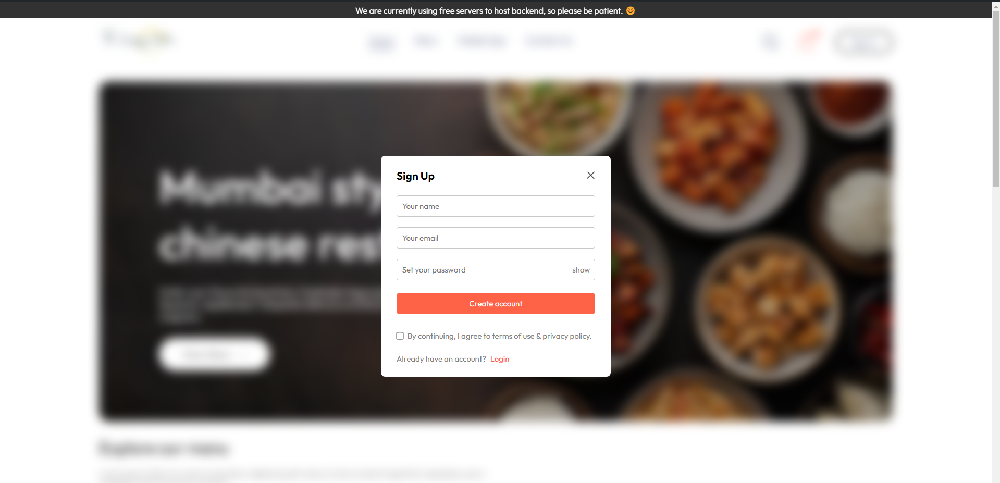
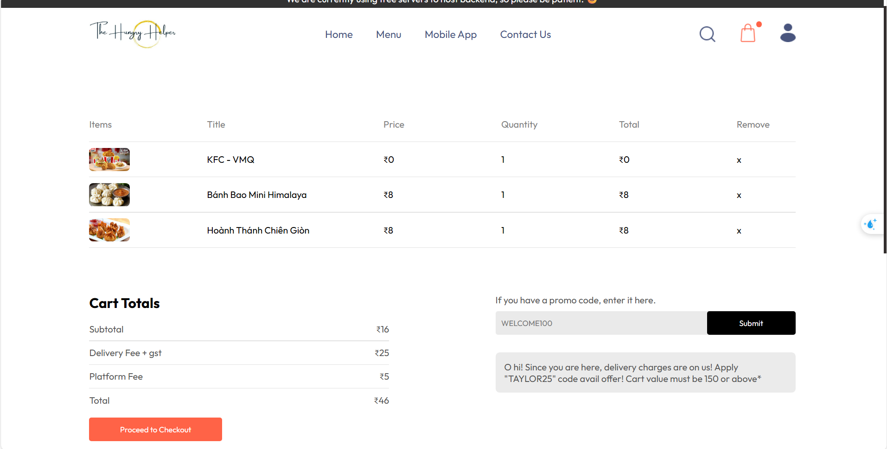
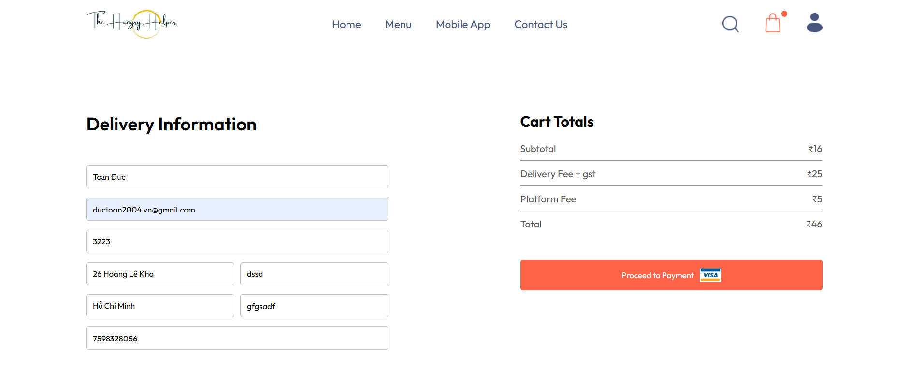
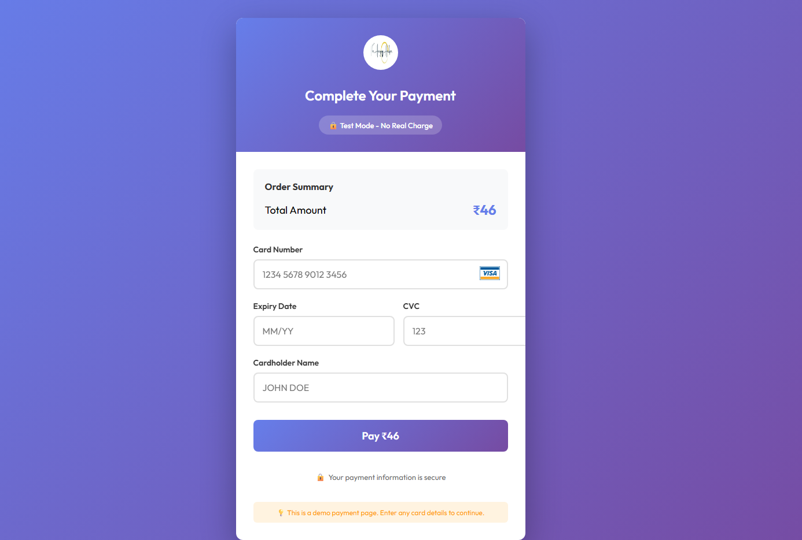
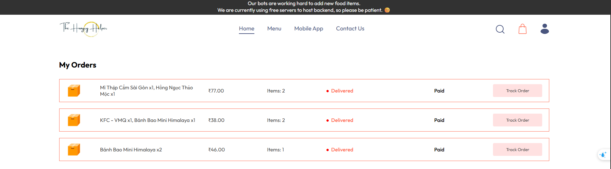
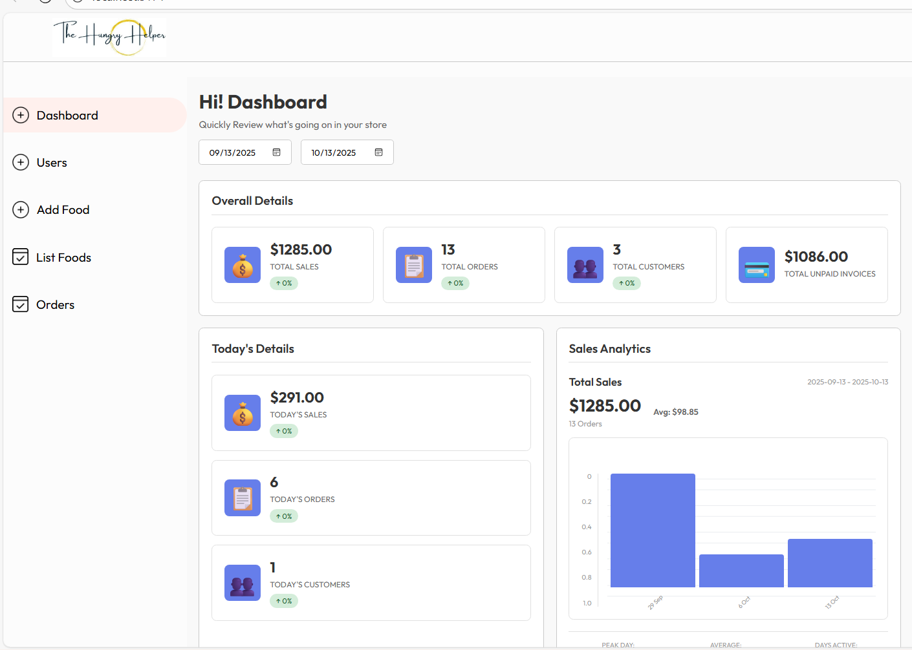
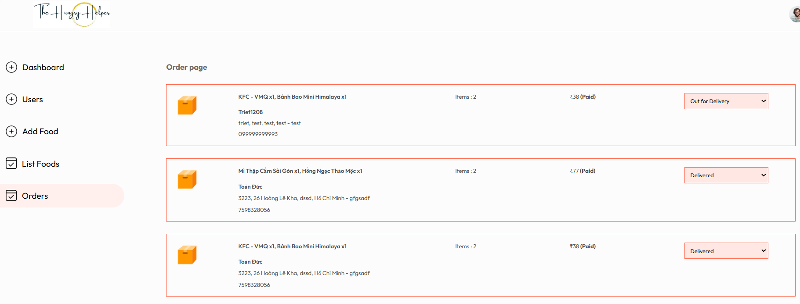
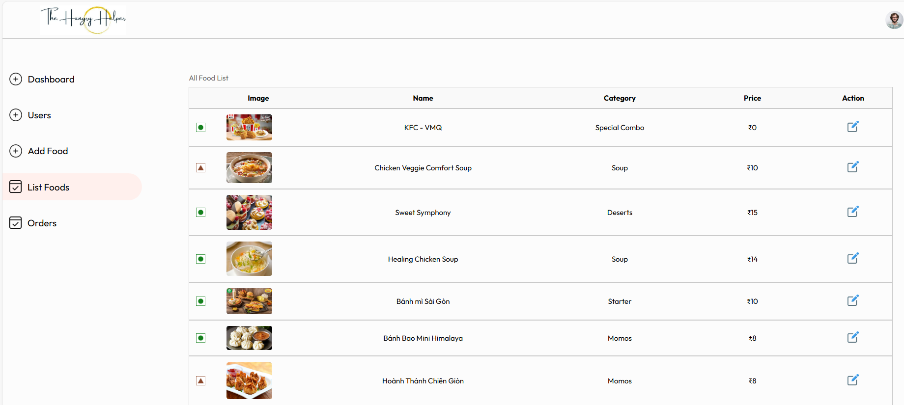
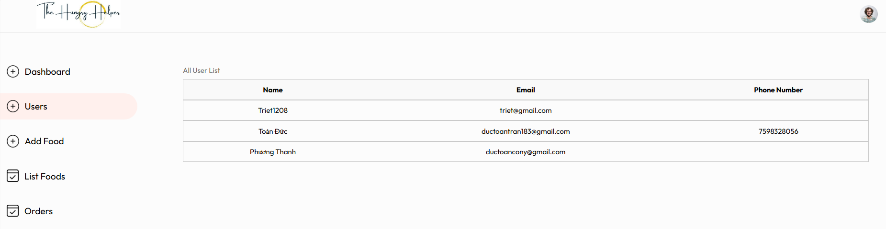

# 🍽️ TT-CNPM - FoodFast Delivery 🍽️

Đồ án FoodFast Delivery về chủ đề CI/CD và giám sát trên hệ thống 3 lớp. Ứng dụng đặt hàng thức ăn trực tuyến được xây dựng với React JS cho frontend và Node JS, Express cho việc tạo REST APIs cùng với MongoDB để lưu trữ dữ liệu.

Hệ thống bao gồm một admin panel để quản trị viên có thể theo dõi đơn hàng, thêm/cập nhật món ăn mới và chỉnh sửa trạng thái đơn hàng.

## 🚀 Key Features (Tính năng chính)

- 🔐 **JWT Authentication**: Sử dụng JWT để xác thực và phân quyền an toàn
- ☁️ **Cloudinary Integration**: Lưu trữ file ảnh trên cloud để truy xuất nhanh hơn
- 💾 **Local Storage**: Lưu giỏ hàng của người dùng vào local storage
- 🎟️ **Coupon Code System**: Hệ thống mã giảm giá tích hợp
- 💳 **Stripe Payment**: Tích hợp hệ thống thanh toán Stripe
- 💵 **Multiple Payment Options**: Nhiều phương thức thanh toán bao gồm COD (Cash On Delivery)
- 📦 **Order Tracking**: Hệ thống theo dõi đơn hàng nâng cao
- 📊 **Admin Dashboard**: Thống kê doanh thu, đơn hàng, khách hàng
- 🔔 **Email Notifications**: Thông báo qua email khi đặt hàng và cập nhật trạng thái
- 🎨 **Responsive Design**: Giao diện responsive cho mọi thiết bị

## 🛠️ Tech Stack (Công nghệ sử dụng)

- ⚛️ **React JS**: Frontend framework
- 🟢 **Node JS**: Backend runtime environment
- 🚀 **Express**: Web application framework
- 🍃 **MongoDB**: NoSQL database
- 🐳 **Docker**: Containerization (optional)
- 📊 **Prometheus & Grafana**: Monitoring và visualization (infra)

## 📚 Libraries (Thư viện sử dụng)

### Frontend
- 📡 **Axios**: HTTP client để gọi API
- 🍞 **React-Toastify**: Hiển thị thông báo
- 🎨 **React Router DOM**: Routing
- ⚡ **Vite**: Build tool và dev server

### Backend
- 🔑 **JWT (jsonwebtoken)**: Token-based authentication
- 📦 **Multer**: Xử lý file upload
- ☁️ **Cloudinary**: Cloud storage cho ảnh
- 🛡️ **bcrypt**: Mã hóa mật khẩu
- 💳 **Stripe**: Payment gateway
- ✅ **Validator**: Validate dữ liệu đầu vào
- 📧 **Nodemailer**: Gửi email
- 🗄️ **Mongoose**: MongoDB object modeling

## 📁 Cấu trúc thư mục

```
TT-CNPM/
├── backend/              # Source code backend (Node.js/Express, REST API)
│   ├── controllers/      # Business logic controllers
│   ├── routes/          # API routes
│   ├── middleware/      # Authentication, file upload, email
│   ├── config/          # Configuration files
│   └── test/            # Unit tests
├── frontend/            # Source code frontend web (React.js)
│   ├── src/
│   │   ├── components/  # Reusable components
│   │   ├── pages/       # Page components
│   │   ├── context/     # Context API
│   │   └── assets/      # Static assets
│   └── public/          # Public files
├── admin/               # Admin panel (React.js)
│   ├── src/
│   │   ├── components/  # Admin components
│   │   └── pages/       # Admin pages (Dashboard, Orders, Products, Users)
│   └── public/
├── database/            # Database models và seeders
│   ├── models/          # Mongoose schemas
│   └── seed.js          # Database seeder
├── infra/               # Docker Compose, Prometheus, Grafana
└── .github/workflows/   # CI/CD pipelines (GitHub Actions)
```

## 🖥️ How to run in your local server? (Cách chạy trên server local)

### Yêu cầu tiên quyết
- Node.js (v14 trở lên)
- MongoDB (local hoặc MongoDB Atlas)
- npm hoặc yarn

### Các bước cài đặt

1. **Clone repository này**
   ```bash
   git clone https://github.com/ToanTranDuc/TT-CNPM.git
   cd TT-CNPM
   ```

2. **Cài đặt dependencies cho cả 3 thư mục**
   
   Mở 3 terminal riêng biệt và chạy:
   
   **Terminal 1 - Backend:**
   ```bash
   cd backend
   npm install
   ```
   
   **Terminal 2 - Frontend:**
   ```bash
   cd frontend
   npm install
   ```
   
   **Terminal 3 - Admin:**
   ```bash
   cd admin
   npm install
   ```

3. **Cấu hình Environment Variables**
   
   Tạo file `.env` trong thư mục gốc với nội dung:
   ```env
   # MongoDB
   MONGODB_URI=your_mongodb_connection_string
   
   # JWT
   JWT_SECRET=your_jwt_secret_key
   
   # Server
   PORT=5000
   DOMAIN=http://localhost:5000
   
   # Cloudinary
   CLOUDINARY_CLOUD_NAME=your_cloud_name
   CLOUDINARY_API_KEY=your_api_key
   CLOUDINARY_API_SECRET=your_api_secret
   
   # Stripe
   STRIPE_SECRET_KEY=your_stripe_secret_key
   
   # Email (Nodemailer)
   EMAIL_USER=your_email@gmail.com
   EMAIL_PASS=your_app_password
   ```

4. **Seed Database (Optional)**
   ```bash
   node database/seed.js
   ```

5. **Chạy ứng dụng**
   
   Trong mỗi terminal, chạy lệnh:
   
   **Backend:**
   ```bash
   npm run dev
   # Server chạy tại http://localhost:5000
   ```
   
   **Frontend:**
   ```bash
   npm run dev
   # App chạy tại http://localhost:5173
   ```
   
   **Admin:**
   ```bash
   npm run dev
   # Admin panel chạy tại http://localhost:5174
   ```

6. **Truy cập ứng dụng**
   - Frontend (Customer): `http://localhost:5173`
   - Admin Panel: `http://localhost:5174`
   - Backend API: `http://localhost:5000`

## 🧪 Running Tests

```bash
cd backend
npm test
```

## 📸 Screenshots (Màn hình giao diện)

### Customer Frontend

**Homepage - Trang chủ**

*Giao diện trang chủ với menu thức ăn đa dạng*

**Food Menu - Thực đơn**

*Danh sách món ăn theo danh mục với khả năng thêm vào giỏ hàng*

**Cart Page - Giỏ hàng**

*Trang giỏ hàng với tính năng áp dụng mã giảm giá*

**Checkout - Thanh toán**


*Form thông tin giao hàng và thanh toán*

**Order Tracking - Theo dõi đơn hàng**

*Theo dõi trạng thái đơn hàng của bạn*

### Admin Panel

**Dashboard - Bảng điều khiển**

*Thống kê tổng quan về doanh thu, đơn hàng, khách hàng*

**Order Management - Quản lý đơn hàng**

*Quản lý và cập nhật trạng thái đơn hàng*

**Product Management - Quản lý sản phẩm**

*Thêm, sửa, xóa sản phẩm*

**User Management - Quản lý người dùng**

*Xem danh sách người dùng đã đăng ký*

## 🌿 Nhánh Git

- `main`: Nhánh chính để release/demo
- `develop`: Nhánh phát triển, merge code trước khi đưa lên main
- `milestone/ci-setup`: Thiết lập CI/CD và monitoring
- `feature/*`: Nhánh cho từng chức năng nhỏ

## 🚀 CI/CD Pipeline

Dự án sử dụng GitHub Actions để tự động hóa:
- ✅ Build và test code
- ✅ Linting và code quality checks
- ✅ Deploy tự động (nếu cấu hình)

## 📊 Monitoring

- **Prometheus**: Thu thập metrics
- **Grafana**: Visualization và dashboard
- **Docker Compose**: Container orchestration cho monitoring stack

## 🤝 Contributing

1. Fork repository
2. Tạo branch mới (`git checkout -b feature/AmazingFeature`)
3. Commit changes (`git commit -m 'Add some AmazingFeature'`)
4. Push to branch (`git push origin feature/AmazingFeature`)
5. Mở Pull Request

## 📝 License

Distributed under the MIT License.

## 👥 Authors

- **ToanTranDuc** - [GitHub Profile](https://github.com/ToanTranDuc)

## 🙏 Acknowledgments

- Inspired by [The Hungry Helper](https://github.com/souravcodes1080/food-delivery)
- Icons from various open-source libraries
- UI/UX design inspiration from modern food delivery apps